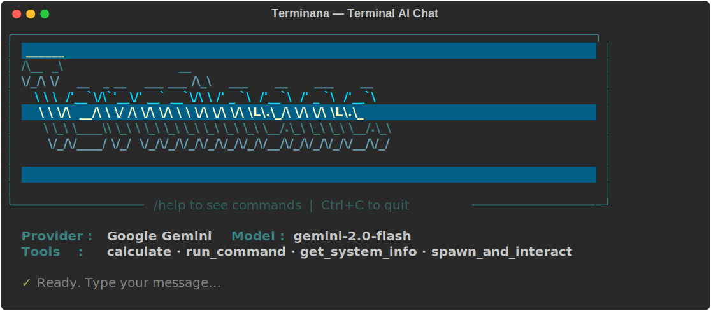
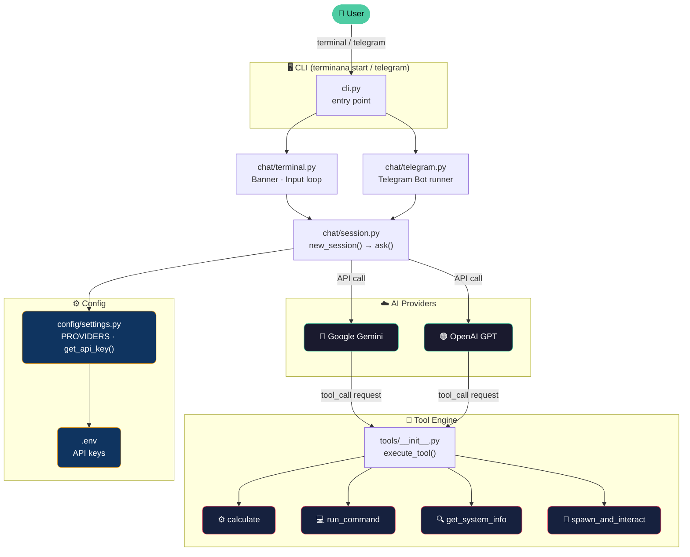

<div align="center">



<br/>


<br/>

> **AI trực tiếp trong terminal của bạn.** Gọi tool cục bộ, chạy lệnh, tính toán, lấy thông tin hệ thống — tất cả qua chat với Gemini hoặc OpenAI.

<br/>

```bash
pip install terminana && terminana start
```

</div>

---

## ⚡ Tính năng nổi bật

<table>
<tr>
<td width="50%">

### 🤖 Đa provider AI
- **Google Gemini** (gemini-2.0-flash, ...)
- **OpenAI** (gpt-4o, gpt-4-turbo, ...)
- Chuyển đổi liền mạch ngay trong phiên chat

</td>
<td width="50%">

### 🛠️ Tool calling cục bộ
- Chạy lệnh shell trực tiếp
- Tính toán biểu thức
- Lấy thông tin hệ thống
- Tương tác với tiến trình (pexpect)

</td>
</tr>
<tr>
<td width="50%">

### 💬 Đa giao diện
- **Terminal** — rich text, màu sắc, figlet banner
- **Telegram Bot** — chat từ điện thoại, gọi tool từ xa

</td>
<td width="50%">

### 🔌 Dễ mở rộng
- Thêm tool bằng decorator `@tool` (tự sinh JSON)
- Thêm provider trong vài dòng config
- Dispatcher tự động qua `importlib`

</td>
</tr>
</table>

---

## 🏗️ Kiến trúc hệ thống



---

## 🚀 Cài đặt & chạy

```bash
# Từ PyPI
pip install terminana

# Dev mode (từ source)
git clone <repo> && cd terminana
pip install -e .
```

```bash
terminana start       # 💬 Chat terminal
terminana telegram    # 📱 Telegram bot
terminana help        # ❓ Trợ giúp
```

---

## ⚙️ Cấu hình `.env`

```env
GEMINI_API_KEY=AIza...
OPENAI_API_KEY=sk-...
TELEGRAM_BOT_TOKEN=...   # chỉ cần nếu dùng Telegram
```

> Nếu thiếu key, Terminana sẽ **hỏi khi khởi động** và cho phép lưu vào `.env`.

---

## 💬 Lệnh trong chat

| Lệnh | Hành động |
|:---:|---|
| `/help` | 📋 Danh sách lệnh |
| `/switch` | 🔄 Đổi provider / model / tools |
| `/reset` | 🔁 Session mới, giữ provider/model |
| `/clear` | 🧹 Xoá màn hình |
| `/quit` | 🚪 Thoát |

---

## 📁 Cấu trúc

```
terminana/
├── cli.py              ← entry point: lệnh terminana
├── config/settings.py  ← PROVIDERS, get_api_key()
├── chat/
│   ├── session.py      ← new_session() → ask()
│   ├── setup.py        ← UI chọn provider/model/tools
│   ├── terminal.py     ← banner + vòng lặp chat
│   └── telegram.py     ← Telegram bot runner
├── tools/
│   ├── __init__.py     ← execute_tool(), get_tool_definitions()
│   ├── decorator.py    ← @tool decorator
│   ├── generate.py     ← sinh JSON từ @tool
│   └── json/
│       └── tools.json  ← source of truth cho AI
└── core/
    ├── system_tools.py     ← calculate, get_system_info
    └── pexpect_tools.py    ← run_command, spawn_and_interact
```

---

## 🔧 Viết tool mới

### ✨ Cách 1 — Decorator (tự sinh JSON)

```python
# ai_skills/core/my_tools.py
from ai_skills.tools.decorator import tool

@tool
def read_file(path: str) -> dict:
    """Đọc nội dung file trên máy.

    path : Đường dẫn đến file cần đọc.
    """
    try:
        return {"success": True, "content": open(path, encoding="utf-8").read()}
    except Exception as e:
        return {"success": False, "error": str(e)}
```

Sau đó sinh JSON:

```bash
python -m ai_skills.tools.generate
# → tự cập nhật tools.json, không cần làm thêm gì
```

### 📝 Cách 2 — JSON tay (function ở bất kỳ đâu)

1. Viết function Python (trả về `dict`)
2. Thêm object vào `ai_skills/tools/json/tools.json`:

```json
{
  "name": "fetch_url",
  "description": "Tải nội dung một URL.",
  "module": "ai_skills.core.http_tools",
  "function": "fetch_url",
  "parameters": {
    "type": "object",
    "properties": {
      "url": { "type": "string", "description": "URL cần tải." }
    },
    "required": ["url"]
  }
}
```

> Dispatcher tự `importlib` theo `module` + `function`. Không cần sửa code nào khác.

---

## 🌐 Thêm provider

**`config/settings.py`** — đăng ký:
```python
PROVIDERS = {
    "gemini":    {"env_key": "GEMINI_API_KEY"},
    "openai":    {"env_key": "OPENAI_API_KEY"},
    "anthropic": {"env_key": "ANTHROPIC_API_KEY"},  # thêm
}
```

**`chat/session.py`** — implement backend:
```python
def _anthropic_session(api_key, model, on_tool, enabled_tools):
    import anthropic
    client  = anthropic.Anthropic(api_key=api_key)
    history = []

    def ask(prompt: str) -> str:
        history.append({"role": "user", "content": prompt})
        resp  = client.messages.create(model=model, max_tokens=4096,
                    system=SYSTEM_PROMPT, messages=history)
        reply = resp.content[0].text
        history.append({"role": "assistant", "content": reply})
        return reply
    return ask
```

Đăng ký trong `new_session()`:
```python
if provider == "anthropic":
    return _anthropic_session(api_key, model, on_tool, enabled_tools)
```

---

## 🎨 Tuỳ chỉnh giao diện

**Font banner** (`terminal.py`):
```python
art = pyfiglet.figlet_format("Terminana", font="slant")
# Xem danh sách: print(pyfiglet.FigletFont.getFonts())
```

**System prompt** (`session.py`):
```python
SYSTEM_PROMPT = "Bạn là trợ lý DevOps chuyên về CI/CD và deployment."
```

---

## 📦 API nội bộ

```python
from ai_skills.chat.session import new_session
from ai_skills.tools import execute_tool, get_tool_definitions

# Tạo session
ask = new_session("gemini", api_key, "gemini-2.0-flash",
                  on_tool=print,              # in tên tool khi AI gọi
                  enabled_tools=["calculate"]) # None = tất cả

reply = ask("2 + 2 bằng mấy?")

# Gọi tool trực tiếp
result = execute_tool("calculate", {"expression": "2 ** 10"})
# → {"success": True, "result": 1024}

# Lấy definitions (để gắn vào AI)
defs = get_tool_definitions(enabled=["calculate", "run_command"])
```

---

## 🚢 Publish

```bash
# Sửa version trong pyproject.toml, rồi:
python -m build
twine upload dist/terminana-X.Y.Z*
```

Đặt token vào `~/.pypirc` để khỏi nhập lại:
```ini
[pypi]
username = __token__
password = pypi-YOUR_TOKEN_HERE
```

---

<div align="center">

[](https://github.com/)

**Made with ❤️ — Terminal meets AI**

</div>
